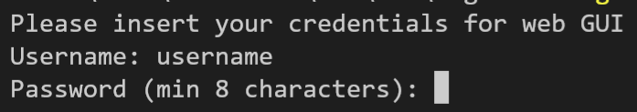
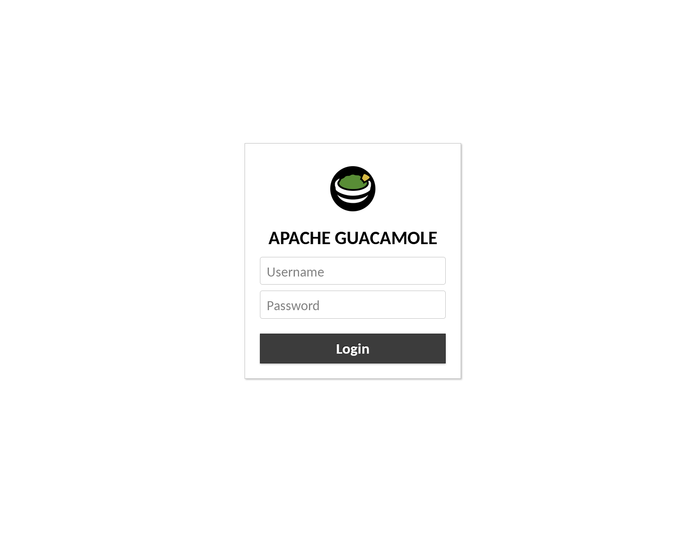
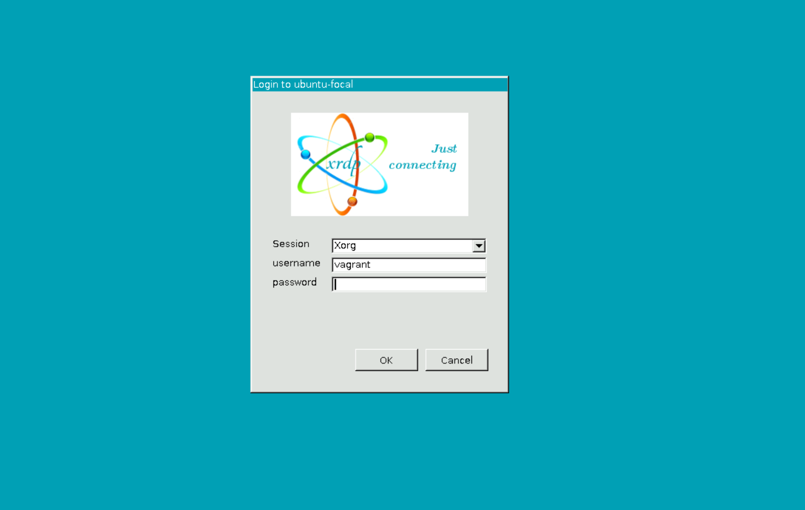
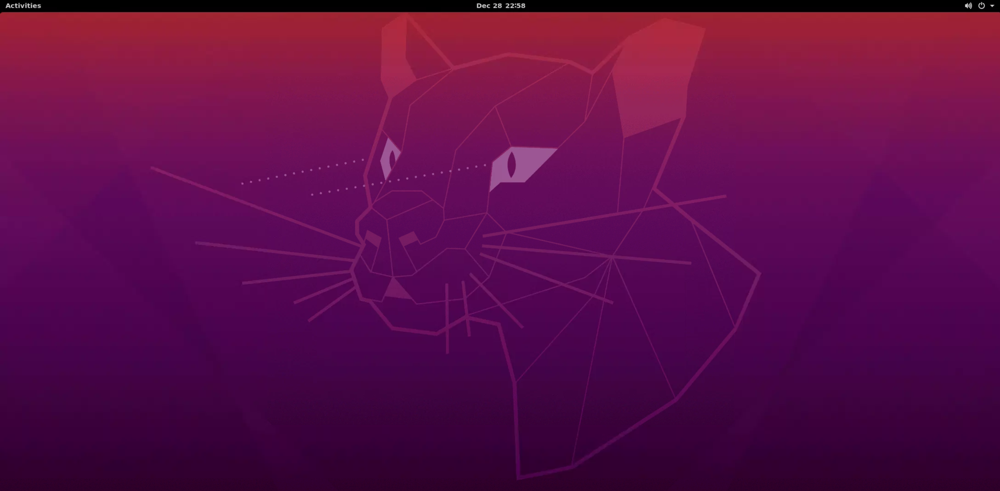
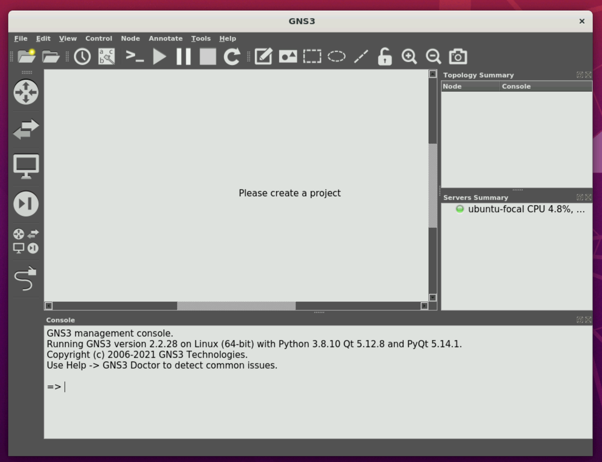

# Homework: automating deployment of GNS3

## User Instructions

### Required information

GNS3 web UI url: [http://192.168.0.100:8080/guacamole/](http://192.168.0.100:8080/guacamole/)  
GNS3 web UI login information is created by user at script startup.  
Ubuntu username: ``vagrant``  
Ubuntu password: ``vagrant``

### Setting up the environment

1. Download and install Vagrant from the [official download page](https://www.vagrantup.com/downloads)
2. Download and install VirtualBox from the [official download page](https://www.virtualbox.org/wiki/Downloads)
3. Restart your PC
4. Enable virtualization in [BIOS](https://www.virtualmetric.com/blog/how-to-enable-hardware-virtualization)
5. Open your preferred terminal (cmd, Powershell, bash...) in the folder containing the [Vagrantfile](vagrant/Vagrantfile)
6. Run ``vagrant init`` in the terminal
7. Run ``vagrant up`` in the terminal
8. Enter your login information when prompted by the script
9. Wait until the deployment finishes
10. Connect to the [web GUI](http://192.168.0.100:8080/guacamole/)
11. When done, end the session with ``vagrant destroy -f``

## Development information

### Problems during development

- To obtain the latest Guacamole server version, it has to be downloaded from the GitHub instead of the official download page, as version 1.3.0 has errors when compiling.
- Some workarounds had to be made so the configs can be written to their correct locations (see the [code](vagrant/bootstrap.sh))
- Xrdp had to be installed for Guacamole to work (not specified in the documentation)
- Password hashing had to be disabled as openssl likes to mangle the input when writing into the config file

### Deployment sequence

- The VM is created
- Login information is acquired from the user
- A shell script is run that configures most other files
- ``man-db`` is renoved
- remote repositories are set up
- GNS3 is installed
- Guacamole dependencies are installed
- Apache Tomcat is set up using the following config:

```
[Unit]
Description=Tomcat 9 servlet container
After=network.target

[Service]
Type=forking

User=tomcat
Group=tomcat

Environment=\"JAVA_HOME=/usr/lib/jvm/java-11-openjdk-amd64\"
Environment=\"JAVA_OPTS=-Djava.security.egd=file:///dev/urandom -Djava.awt.headless=true\"

Environment=\"CATALINA_BASE=/opt/tomcat/tomcatapp\"
Environment=\"CATALINA_HOME=/opt/tomcat/tomcatapp\"
Environment=\"CATALINA_PID=/opt/tomcat/tomcatapp/temp/tomcat.pid\"
Environment=\"CATALINA_OPTS=-Xms512M -Xmx1024M -server -XX:+UseParallelGC\"

ExecStart=/opt/tomcat/tomcatapp/bin/startup.sh
ExecStop=/opt/tomcat/tomcatapp/bin/shutdown.sh

[Install]
WantedBy=multi-user.target
```

- Guacamole is compiled and installed
- Guacamole login configuration is set up

```xml
<user-mapping>

    <!-- Per-user authentication and config information -->

    <!-- A user using md5 to hash the password
         guacadmin user and its md5 hashed password below is used to 
             login to Guacamole Web UI-->
    <authorize 
            username=\"$1\"
            password=\"$2\">

        <connection name=\"Windows Server 2019\">
            <protocol>rdp</protocol>
            <param name=\"hostname\">192.168.0.100</param>
            <param name=\"port\">3389</param>
            <param name=\"username\">vagrant</param>
            <param name=\"ignore-cert\">true</param>
        </connection>

    </authorize>

</user-mapping>
```

- Xrdp is installed
- ``Authentication is required to create a color managed device`` message is surpressed
- Default Ubuntu desktop is installed
- VM is rebooted

### Images

- User login information prompt
- Login screen
- RDP login screen
- Ubuntu desktop
- GNS3 app
